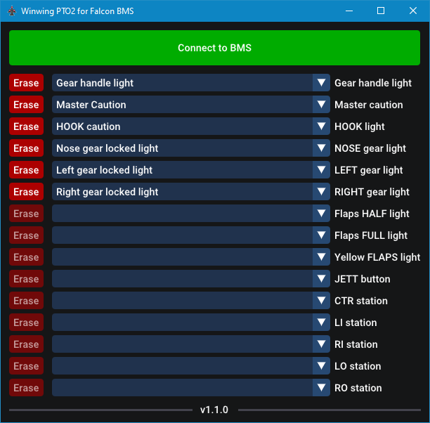

<h1 align="center">PTO2 for BMS</h1>

<h3 align="center">A small utility to synchronize your Winwing PTO2 lights with Falcon BMS</h3>

  

## Installation instructions

Download the `.exe` from the releases, drop it wherever you want, and run it. That's it!

**Windows Defender/SmartScreen might issue a warning.** That's normal! Click "More info" and "Run anyway". I can't pay a certificate to permanently avoid this warning. If you need proof that the software is safe, the source code is right there :)

## Configuration file

The executable creates a `PTO2_for_BMS.conf` file in your BMS `/User/Config` directory. You shouldn't edit it yourself, but you can share it with your friends to exchange configurations. If you delete it, the app will restore a default config file with the basics assigned.

## Supported PTO2 firmware versions
At the moment, this app only supports the PTO2 firmware version `1.04` (latest version a the time of writing). If your firmware is too old, please update it through SimAppPro. If your firmware is newer, feel free to contact me or submit a GitHub issue to ask for an app update.

## Notes

I had gotten a PTO2 for Christmas, and not being able to check the "3 greens" or the Master Caution on my panel was too frustrating. Inspired by [prestonflying's contributions](https://forum.dcs.world/topic/318859-custom-data-shown-on-ufc/) on the DCS forums with the Winwing UFC, I decided to make it work with BMS. Once it did, I thought I'd make a customisation UI so the tool could be used by my friends. I hope you'll find it useful!

The app writes HID output reports to the PTO2. I intercepted the messages that SimAppPro sends to the PTO2 to control the lights, and simply reproduced them in the software. The core implementation is very small, a few dozen lines of code. Everything else is just bells, whistles, and UI sugarcoating.

This tool uses the following open-source libraries. Thanks!
- [Dear ImGui](https://github.com/ocornut/imgui)
- [libusb/hidapi](https://github.com/libusb/hidapi)
- [nlohmann/json](https://github.com/nlohmann/json)
- [glfw](https://github.com/glfw/glfw/)
